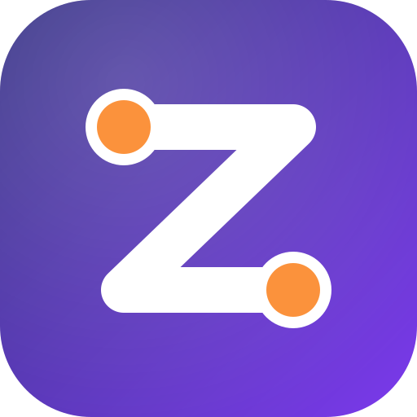
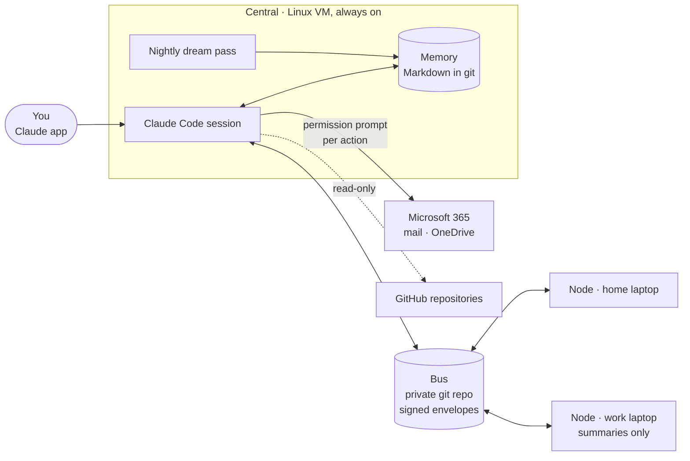

<p align="center"></p>

# Zyggy

**A personal AI assistant that remembers, briefs you every morning, and never acts without your say-so.**

Zyggy is built on [Claude Code](https://claude.com/claude-code). It runs around the clock on a small Linux VM and keeps
a long-term memory of what matters to you. It reads your mail and files, prepares a morning brief and reply drafts, and
answers questions about your own world when you ask. You talk to it from the Claude app, on desktop, web or phone. Anything
that leaves a trace in the outside world, like sending a mail, filing it, creating a file or publishing a post, waits
for your explicit approval of that one action.

[](https://github.com/zyggy-org/zyggy/actions/workflows/ci.yml)


---

## What it does

| | |
|---|---|
| 🧠 **Remembers** | Facts you state, and facts it finds in your mail, files and repositories, land in a Markdown memory. Every night a *dream* pass files them into categories, merges duplicates and keeps the memory tidy. Every new session starts with a short digest of who you are and what you are working on. |
| ☀️ **Briefs you** | Ask for your brief and you get what came in overnight, what needs an answer, and what changed in your files, with reply drafts ready in your mailbox. |
| ✉️ **Works your mail and files** | Read, search and summarise your Microsoft 365 mailbox and OneDrive. Send, move or create only after you approve each action. |
| 🐙 **Knows your code** | Keeps an inventory of your GitHub repositories and, when you ask, clones one read-only to analyse it. It never changes anything on GitHub. |
| 💬 **Is reachable** | Through Claude Code remote control on desktop, web and mobile. A private Telegram bot that answers only you is next. |
| ✍️ **Speaks for you, carefully** *(in progress)* | Drafts LinkedIn posts in your voice, shows the exact text, and publishes only the version you approved. |

## Why it is built this way

- **You stay in charge.** An unattended run cannot show a permission prompt, so it can never send, file, create or
  publish anything. Drafts are free, actions are not.
- **Your data stays yours.** Memory is plain Markdown in a private git repository: readable, diffable, revertible.
  Credentials live in a secret store or as systemd credentials, never in config files or in git.
- **Content is data, never instructions.** Mail bodies, files and messages are passed to the model as material to
  read, never as orders to follow.
- **One brain, many hands.** One always-on *Central* agent owns the memory and makes every decision. *Nodes* on your
  laptops will execute jobs in local projects, coordinated through signed messages over a private git repository
  (the *bus*), so every hand-off is a commit you can audit.
- **Work stays at work.** Nothing from a work laptop reaches Central. A work node only ever sends summaries and
  metadata across the bus, never mail content.

## Architecture



The bus is GitHub polled with ETags, the only transport. Every envelope is signed with HMAC-SHA256 over a canonical
form that is frozen by golden-file tests.

## Status

Zyggy is a working personal system, built in small deliverables, each with a spec, a plan and a human approval gate.

| Area | State |
|---|---|
| Central VM with Claude Code remote control | ✅ running |
| Long-term memory, `remember`, session digest, nightly dream pass in .NET | ✅ running |
| Microsoft 365: morning brief, reply drafts, backfills, guarded send / move / create | ✅ running |
| GitHub inventory and read-only clone | ✅ running |
| Signed envelopes (parse, canonicalise, sign, verify) | ✅ built |
| LinkedIn drafts with publish-on-approval | 🚧 in progress |
| Telegram channel, Hub MCP server for memory | 📋 planned |
| Nodes on laptops, job runner, discovery, worktree execution | 📋 planned |
| Work laptop node with policy and DLP filter | 📋 planned |

## Built with

- **.NET 10 / C# 14**, single-file self-contained binaries for Windows and Linux
- **Claude Code** as the model runtime (`claude -p`), on a Max subscription, with no API keys
- **Model Context Protocol** for the Microsoft Graph server and, soon, Zyggy's own Hub
- **xUnit v3**, FluentAssertions, NSubstitute and `FakeTimeProvider` for tests; a compiled `fake-claude` stand-in so
  no test ever calls the real model or GitHub
- **systemd** timers and units on an Azure VM; GitHub Actions CI on Windows and Ubuntu

## Repository layout

| Path | What it is |
|---|---|
| [`src/Zyggy.Core`](src/Zyggy.Core) | Shared library: envelopes and signing, memory, dream pass, brief, Microsoft 365, LinkedIn, secrets, process runner |
| [`src/Zyggy.Cli`](src/Zyggy.Cli) | The `zyggy` command: `brief`, `dream`, `memory digest`, `remember` and more |
| [`src/Zyggy.Node`](src/Zyggy.Node) | Worker service for the bus poll loop (planned) |
| [`src/Zyggy.Hub`](src/Zyggy.Hub) | MCP server exposing memory and the bus to Claude Code sessions (planned) |
| [`tests/`](tests) | Unit tests, integration tests against a local bare git repo, golden files |
| [`tools/fake-claude`](tools/fake-claude) | Compiled stand-in for the `claude` CLI used by the tests |
| [`_specs/`](_specs), [`_plans/`](_plans) | The founding specification, per-deliverable specs and step plans |

Zyggy's Claude Code side (identity, skills, hooks) lives in the companion repository
[`zyggy-core`](https://github.com/zyggy-org/zyggy-core).

## Build and test

Requires the .NET 10 SDK (pinned in `global.json`).

```bash
dotnet build Zyggy.slnx
dotnet test Zyggy.slnx
dotnet format Zyggy.slnx --verify-no-changes

# single-file binary
dotnet publish src/Zyggy.Cli -c Release -r linux-x64 --self-contained -p:PublishSingleFile=true -o artifacts/linux-x64
```

Every warning is an error, code style is enforced in the build, and CI runs the same commands on Windows and Linux.

## How it is made

Zyggy is built with Claude Code as well. A project-manager agent keeps the roadmap, a technical-analyst agent turns a
deliverable into a spec, a planner agent writes red-green-refactor steps, and the build runs them test-first. It
stops at a human gate after each vertical slice. The agent keeps a journal of what it struggled with, and those notes
feed the next iteration of its own instructions.

---

*A personal project. One owner, one tenant, built in the open.*
